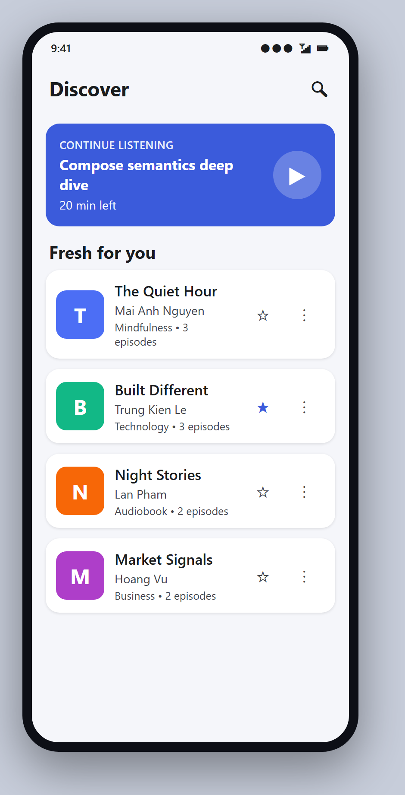
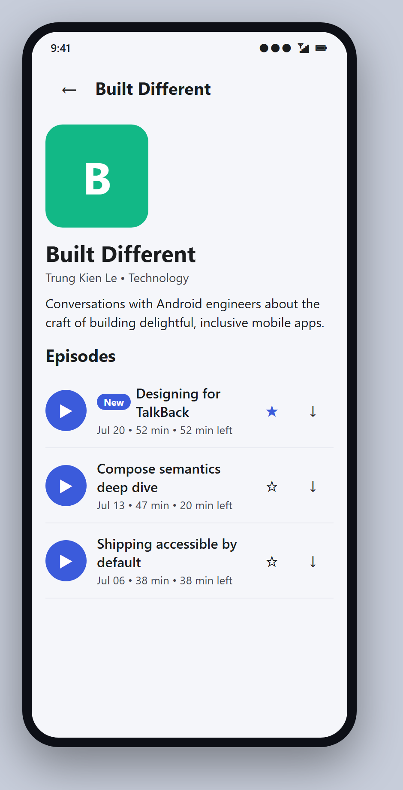
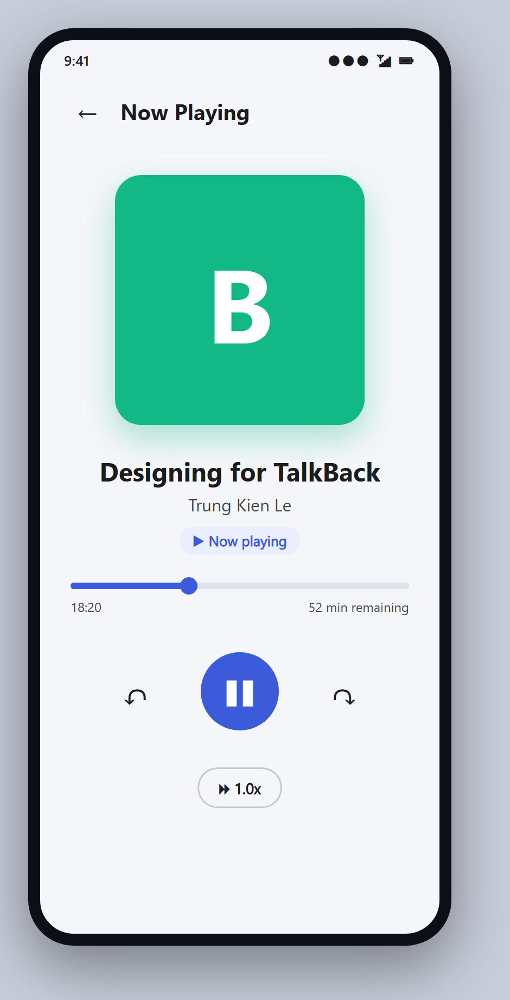

# 🎧 Accessible Podcast — Case Study App

A **front-end-only Jetpack Compose** demo for the report *"Building Accessible Android
Applications"*. It implements a three-screen podcast / audiobook flow and showcases the accessibility
techniques (semantics, TalkBack support, touch targets, font scaling). **There is no backend** — all
data comes from an in-memory mock behind a repository interface.

<p align="center">
  
  
  
</p>

---

## 🚀 Quick start (Android Studio)

```bash
git clone https://github.com/ThanDongVanHoc/PodcastAccessibilityApp.git
```

1. **Android Studio → File ▸ Open** and select the cloned `PodcastAccessibilityApp` folder.
2. Wait for the **Gradle sync** to finish. Android Studio downloads the dependencies and generates
   the Gradle wrapper + `local.properties` (SDK path) automatically — no manual setup.
3. Pick an emulator or a connected device, then press **Run ▶** (the `app` configuration).

That's it. First sync needs an internet connection to fetch dependencies.

**Requirements:** Android Studio Koala (2024.1) or newer · JDK 17 · Android SDK 34
(`minSdk 24`, `targetSdk 34`) · Kotlin 2.0 · Jetpack Compose.

> **Try the accessibility features:** enable **TalkBack** (Settings ▸ Accessibility), install
> **Accessibility Scanner**, and set the system **Font size** to 200% to see the app adapt.

---

## 🧭 User flow

```
Discover (Home)  ──tap card──▶  Podcast detail  ──tap episode──▶  Now Playing (Player)
       │                                                              ▲
       └──────────────── "Continue listening" ────────────────────────┘
```

## 🧩 Where each accessibility technique lives

| Report section | Technique | File |
|---|---|---|
| Core | `contentDescription`, decorative `null` | `ui/components/CoverArt.kt`, `strings.xml` |
| Core | `Role.Button` + `stateDescription` on a custom control | `ui/player/PlayToggle.kt` |
| Core | 48 dp touch targets (`minimumInteractiveComponentSize`) | `ui/home/PodcastCard.kt`, `ui/detail/EpisodeRow.kt` |
| Core | `sp` typography + non-linear font scaling | `ui/theme/Type.kt` |
| Core | heading navigation (`heading()`) | `HomeScreen.kt`, `PodcastDetailScreen.kt` |
| Advanced | `mergeDescendants` | `PodcastCard.kt`, `EpisodeRow.kt` |
| Advanced | `clearAndSetSemantics` + `customActions` | `PodcastCard.kt`, `EpisodeRow.kt` |
| Advanced | `hideFromAccessibility` (decorative cover) | `CoverArt.kt` |
| Advanced | `isTraversalGroup` + `traversalIndex` | `HomeScreen.kt`, `PodcastDetailScreen.kt` |
| Foundation | `liveRegion` playback announcements | `ui/player/PlayerScreen.kt` |
| Testing | Compose semantics assertions + `printToLog`, ATF | `androidTest/.../AccessibilityTest.kt` |

## 📦 Package layout

```
com.mobile.podcast
├── MainActivity.kt
├── data
│   ├── model            Podcast, Episode
│   └── repository       PodcastRepository (interface), MockPodcastRepository, PlayerStateHolder
└── ui
    ├── theme            Color, Type (sp), Theme (M3, contrast-checked)
    ├── navigation       PodcastNavHost (Discover → Detail → Player)
    ├── components       CoverArt
    ├── home             HomeScreen, PodcastCard, ContinueListeningBanner
    ├── detail           PodcastDetailScreen, EpisodeRow
    └── player           PlayerScreen, PlayToggle
```

## 📄 Report

The full written report (LaTeX source + compiled PDF) is in [`report/`](report/) — see
[`report/main.pdf`](report/main.pdf).

## 🧪 Tests

```bash
./gradlew connectedAndroidTest   # runs the accessibility checks in androidTest/
```
